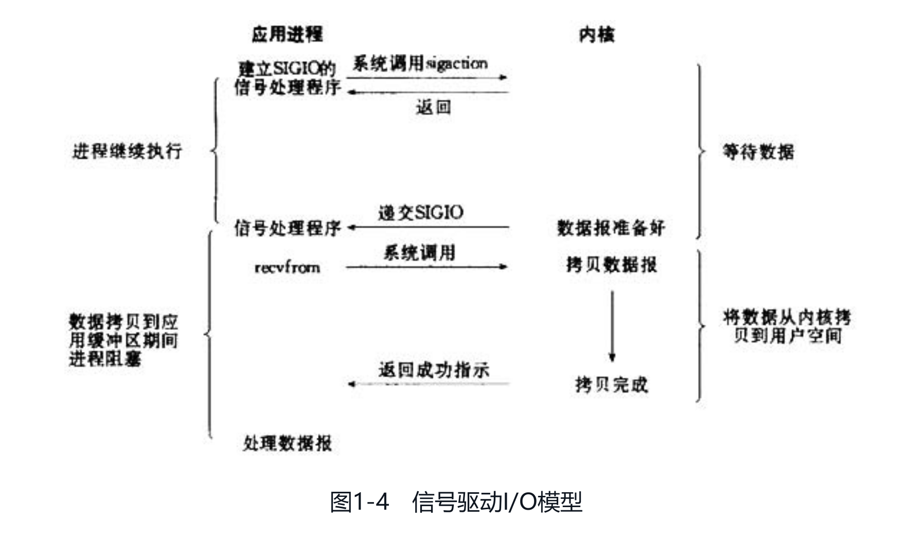

### Linux网络I/O模型简介（摘自《Netty权威指南》

Linux的内核将所有外部设备都看做一个文件来操作，对一个文件的读写操作会调用内核提供的系统命令，返回一个file descriptor（fd，文件描述符）。而对一个socket的读写也会有相应的描述符，称为socketfd（socket描述符），描述符就是一个数字，它指向内核中的一个结构体（文件路径，数据区等一些属性）。

根据UNIX网络编程对I/O模型的分类，UNIX提供了5种I/O模型，分别如下。

1. **阻塞I/O模型**：最常用的I/O模型就是阻塞I/O模型，缺省情形下，所有文件操作都是阻塞的。我们以套接字接口为例来讲解此模型：在进程空间中调用recvfrom，其系统调用直到数据包到达且被复制到应用进程的缓冲区中或者发生错误时才返回，在此期间一直会等待，进程在从调用recvfrom开始到它返回的整段时间内都是被阻塞的，因此被称为阻塞I/O模型，如图1-1所示。

2. **非阻塞I/O模型**：recvfrom从应用层到内核的时候，如果该缓冲区没有数据的话，就直接返回一个EWOULDBLOCK错误，一般都对非阻塞I/O模型进行轮询检查这个状态，看内核是不是有数据到来。如图1-2所示。

3. **I/O复用模型**：Linux提供select/poll，进程通过将一个或多个fd传递给select或poll系统调用，阻塞在select操作上，这样select/poll可以帮我们侦测多个fd是否处于就绪状态。select/poll是顺序扫描fd是否就绪，而且支持的fd数量有限，因此它的使用受到了一些制约。Linux还提供了一个epoll系统调用，epoll使用基于事件驱动方式代替顺序扫描，因此性能更高。当有fd就绪时，立即回调函数rollback。如图1-3所示。

4. **信号驱动I/O模型**：首先开启套接口信号驱动I/O功能，并通过系统调用sigaction执行一个信号处理函数（此系统调用立即返回，进程继续工作，它是非阻塞的）。当数据准备就绪时，就为该进程生成一个SIGIO信号，通过信号回调通知应用程序调用recvfrom来读取数据，并通知主循环函数处理数据。如图1-4所示。

5. **异步I/O**：告知内核启动某个操作，并让内核在整个操作完成后（包括将数据从内核复制到用户自己的缓冲区）通知我们。这种模型与信号驱动模型的主要区别是：信号驱动I/O由内核通知我们何时可以开始一个I/O操作；异步I/O模型由内核通知我们I/O操作何时已经完成。如图1-5所示。

#### 参考资料

[https://www.zhihu.com/question/59975081](https://www.zhihu.com/question/59975081)

---

### 4.3.1 NIO——非阻塞 I/O

### 4.3.3 OIO —旧的阻塞 I/O

Netty 的 OIO 传输实现代表了一种折中：它可以通过常规的传输 API 使用，但是由于它是建立在 java.net 包的阻塞实现之上的，所以它不是异步的。

在 java.net API 中，你通常会有一个用来接受到达正在监听的 ServerSocket 的新连接的线程。会创建一个新的和远程节点进行交互的套接字，并且会分配一个新的用于处理相应通信流量的线程。这是必需的，因为某个指定套接字上的任何 I/O 操作在任意的时间点上都可能会阻塞。使用单个线程来处理多个套接字，很容易导致一个套接字上的阻塞操作也捆绑了所有其他的套接字。

有了这个背景，你可能会想，Netty是如何能够使用和用于异步传输相同的API来支持OIO的呢。答案就是，Netty利用了SO_TIMEOUT这个Socket标志，它指定了等待一个I/O操作完成的最大毫秒数。如果操作在指定的时间间隔内没有完成，则将会抛出一个SocketTimeout Exception。Netty将捕获这个异常并继续处理循环。在EventLoop下一次运行时，它将再次尝试。这实际上也是类似于Netty这样的异步框架能够支持OIO的唯一方式。图 4-3 说明了这个逻辑。

