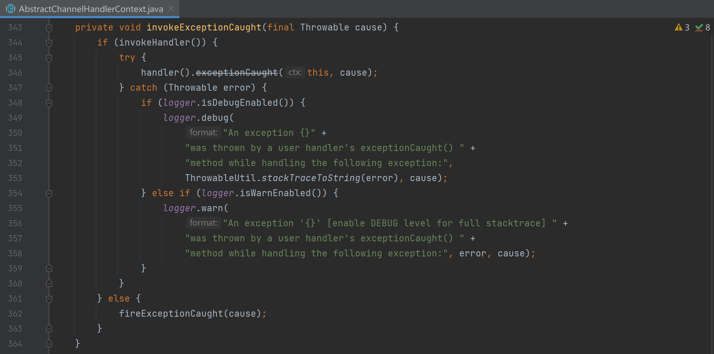
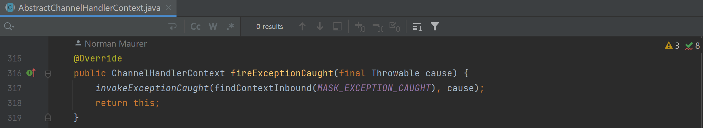
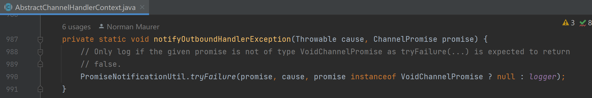
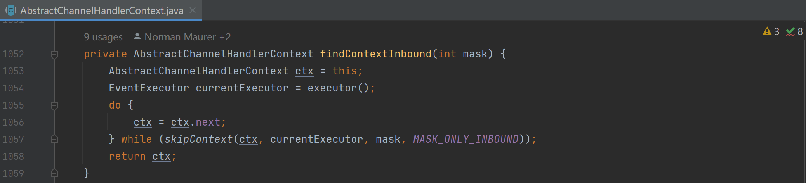
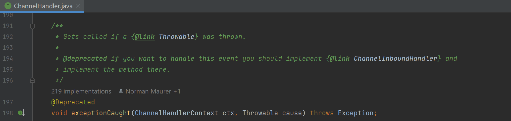
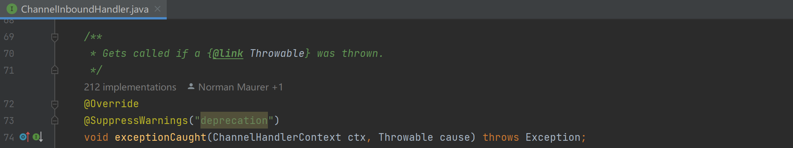

### 水位线

* ChannelOption 提供了两个水位线参数：WRITE_BUFFER_HIGH_WATER_MARK（默认值 64 * 1024） 和 WRITE_BUFFER_LOW_WATER_MARK（默认值 32 * 1024）

* 其关系到 Channel#isWritable() 的返回结果以及 ChannelInboundHandler#channelWritabilityChanged 的触发

* 水位线参数由参数 io.netty.transport.estimateSizeOnSubmit 决定是否启用。当该参数为 true 时，每次调用 ChannelOutboundInvoker#write(Object) 和 ChannelOutboundInvoker#write(Object, ChannelPromise) 都会触发对写入内容的评估。

 * 一旦发现新加进来的字节缓冲区会导致 ChannelOutboundBuffer 的缓冲区低于 WRITE_BUFFER_LOW_WATER_MARK 或高于 WRITE_BUFFER_HIGH_WATER_MARK，都会做出反应。

* 当低于 WRITE_BUFFER_LOW_WATER_MARK 且 Channel#isWritable() 为 false 时，会触发 ChannelInboundHandler#channelWritabilityChanged 事件，其从 ChannelPipeline 尾部流向头部，流经的 ChannelInboundHandler 可对这种情况进行处理，例如重新触发写动作。

* 当高于 WRITE_BUFFER_HIGH_WATER_MARK 且 Channel#isWritable() 为 true 时，会触发 ChannelInboundHandler#channelWritabilityChanged 事件，其从 ChannelPipeline 尾部流向头部，流经的 ChannelInboundHandler 可对这种情况进行处理，例如触发 flush 相关的动作。

* EventLoop 线程或非 EventLoop 线程调用 ChannelOutboundInvoker#write(Object) 和 ChannelOutboundInvoker#write(Object, ChannelPromise) 都会进行以上的评估和事件触发，可以看到上图 175 行 和 194 行的累加动作都进行了并发安全处理。

### 异常处理

* netty 会对入站 ChannelInboundHandler 执行过程产生的异常进行处理。异常可以沿着 ChannelPipeline，从产生异常的那个 ChannelInboundHandler#exceptionCaught 开始，一直往下触发一个 ChannelInboundHandler#exceptionCaught 进行处理，直到末尾。

* 而对于出站 handler 执行过程产生的异常则采用另外的方式，其将异常委托给 ChannelPromise 进行处理。

* 由上可知 #exceptionCaught 只和 ChannelInboundHandler 有关，但由于历史原因，在 ChannelHandler 接口上也提供了 #exceptionCaught 方法，现已经被标记为废弃，而在 ChannelInboundHandler 接口提供该方法。而一些代码因借用多态特性，直接调用 ChannelHandler#exceptionCaught，从而导致这些代码中会编译提示 #exceptionCaught 已被废弃。

