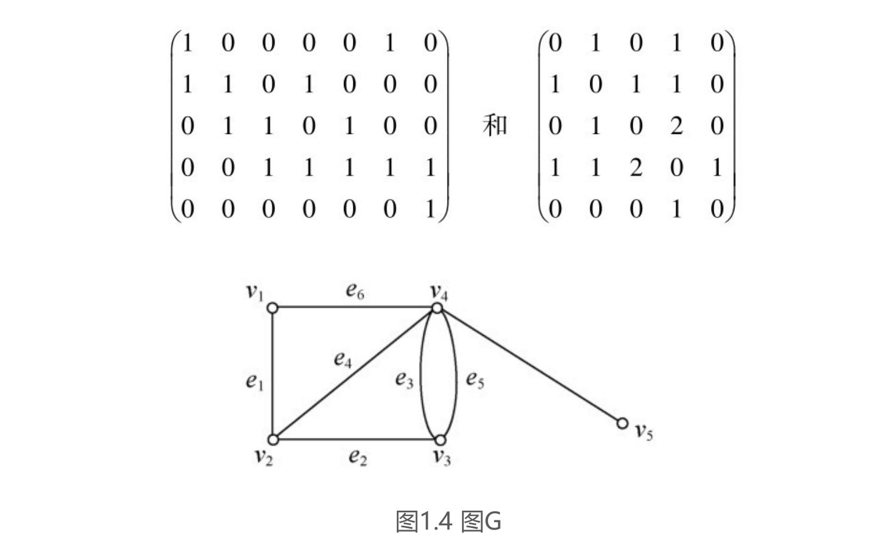
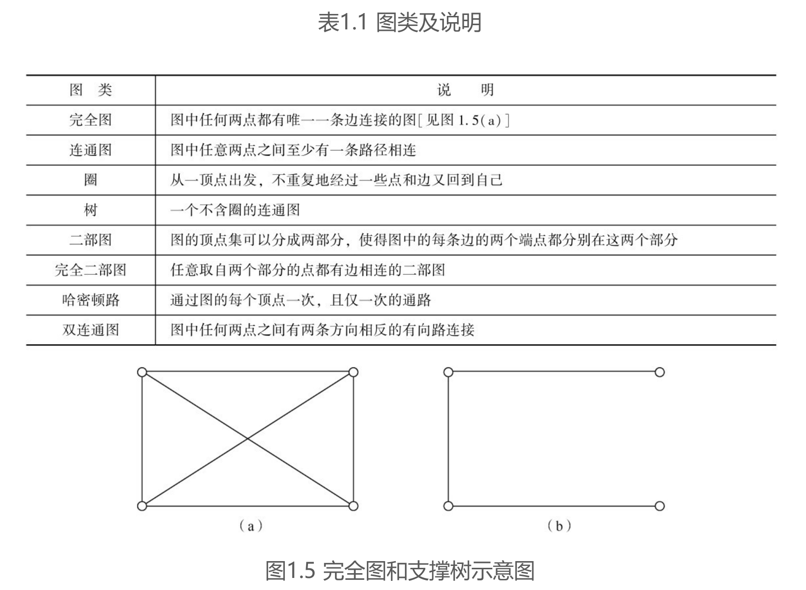
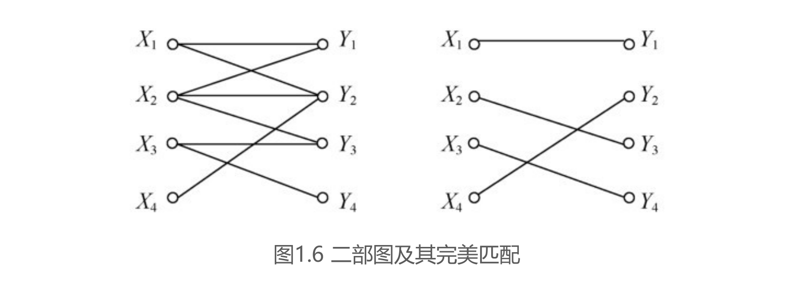

### 第一章
* 哥尼斯堡七桥问题
* 过河问题
一只狼，一只羊，一筐菜位于河的同侧.一个摆渡人要将它们运过河去，由于船小，运力有限，一次只能载三者之一.很显然，狼和羊，羊和菜都不能在无人监视的情况下留在一起，那么摆渡人应该怎样把它们运过河呢?
1. 进行位图建模，0代表南岸，1代表北岸。使用一个长度为4的序列（人，羊，狼，菜）来代表某一时刻的状态，因此总共有16种可能的状态，而由于人不在时（0），狼和羊，羊和菜不能同时为0或1，所以可以排除6种可能的状态。
2. 进行图论建模，列出所有状态转移的可能路线，并求出状态（0000）到状态（1111）的最短路即可。

#### 1.1 图论模型的基本理论
* 顶点，边，邻点
* 路，路的长度（所含边的数目），距离（所含边数最少的路所含的边数）
* 关联矩阵，邻接矩阵  
**关联矩阵**：当图G中顶点集和边集分别为V={v1,v2,…,vn}和E={e1,e2,…,em}时，我们可以写出其对应的关联矩阵M（G）=（mij），其中，如果vi是边ej的一个端点则mij为1，否则为0.  
**邻接矩阵**：当图G的顶点集为V={v1,v2,…,vn}时，我们可以定义它的邻接矩阵A（G）=（aij），其中aij为连接顶点vi与vi的边的数目.  
如图1.4所示，其关联矩阵和邻接矩阵分别为  

* 简单图（两点之间至多有一条边），赋权图，有向图

* 子图，支撑子图（包含所有顶点），支撑树，图的匹配（两两无公共端点的边组成的子图），图的完美匹配

